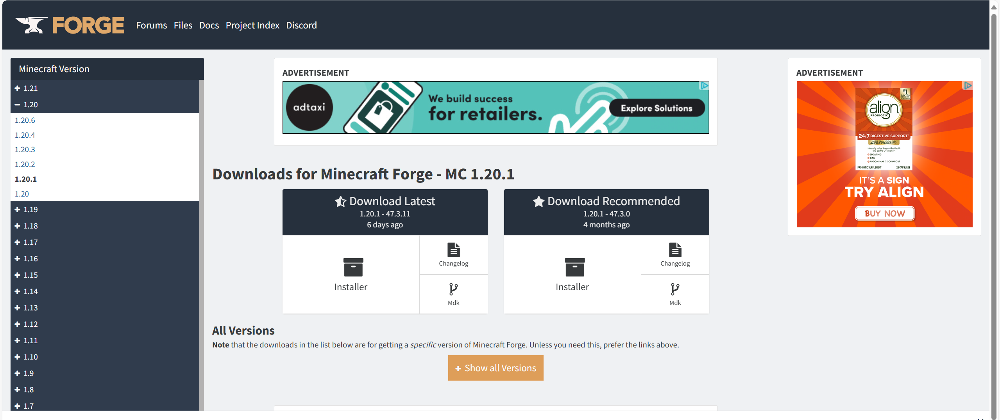
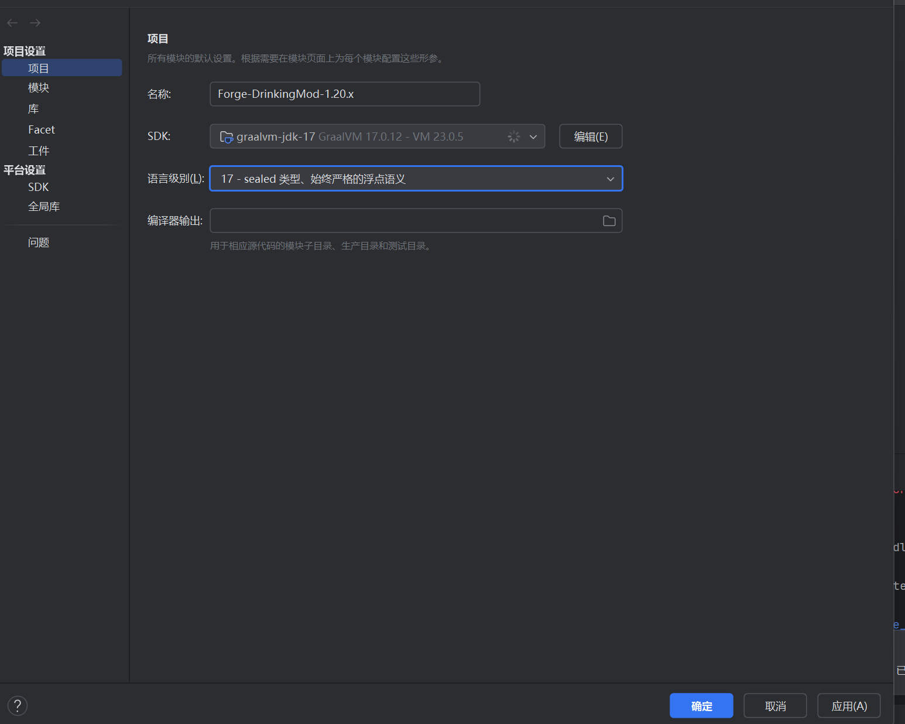

# JAVA-practice-project

#### 介绍
中国海洋大学计算机技术与科学中外合作办学java学习中的娱乐部分，用Java制作Minecraft模组（1.20.x版本）
本实践项目参考Kaupenjoe的mod制作教学视频

#### 软件说明
使用Java语言，IDE 为Intillij，api为Forge开源库

#### 软件安装及环境部署教程

1. 安装JDK（Java Development Kit）
访问 Oracle 或 OpenJDK 网站下载JDK版本（JDK17）。
按照安装程序进行安装。
2. 配置环境变量
**Windows** ：右键"此电脑" → "属性" → "高级系统设置" → "环境变量"。
在“系统变量”中找到 Path，点击“编辑”，添加JDK的 bin 路径（如 C:\Program Files\Java\jdk-17\bin）。
 **Linux/macOS** ：在终端中编辑 .bashrc 或 .zshrc 文件：bash
  _复制代码_ ：
export JAVA_HOME=/path/to/jdk
export PATH=$JAVA_HOME/bin:$PATH
 _然后执行_ ：
bash
 _复制代码_ ：
source ~/.bashrc  # 或 source ~/.zshrc
3. 安装IDE
从 Intillij 官网 下载并安装编辑器。
4. 安装Java扩展包Forge
[Forge官网](https://files.minecraftforge.net/net/minecraftforge/forge/)
下载1.20.1版本

下载好后解压缩
强调：你点开的Mdk下载界面是广告界面，请稍等然后点右上角的skip才会下载，下载的应该是一个压缩包而不是应用
5.在IDE中打开该项目
打开IDE并导入项目文件，请稍等片刻，项目需要先构建
先修改项目设置（左上角文件项目结构）

#### 使用说明

1.  在VScode中，你有可能想将默认的英文语言转化成汉语，那么请按以下操作进行：
 **扩展安装**  
点击左侧的扩展（Extensions）图标。
在搜索栏中输入 "Chinese (Simplified) Language Pack for Visual Studio Code"。
找到该扩展后，点击“安装”。
安装完成后，按下 Ctrl + Shift + P 打开命令面板。
 **切换语言** 
在命令面板中输入 "Configure Display Language"，并选择此选项。
在列表中选择 "zh-CN"（简体中文）。
 **重启VS Code** 
选择语言后，VS Code 会提示你重启编辑器。
点击重启按钮，重启后VS Code的界面将切换为中文。
2.
3.
#### 参与贡献

1.  Fork 本仓库
2.  新建 Feat_xxx 分支
3.  提交代码
4.  新建 Pull Request

#### 特技

1.  使用 Readme\_XXX.md 来支持不同的语言，例如 Readme\_en.md, Readme\_zh.md
2.  Gitee 官方博客 [blog.gitee.com](https://blog.gitee.com)
3.  你可以 [https://gitee.com/explore](https://gitee.com/explore) 这个地址来了解 Gitee 上的优秀开源项目
4.  [GVP](https://gitee.com/gvp) 全称是 Gitee 最有价值开源项目，是综合评定出的优秀开源项目
5.  Gitee 官方提供的使用手册 [https://gitee.com/help](https://gitee.com/help)
6.  Gitee 封面人物是一档用来展示 Gitee 会员风采的栏目 [https://gitee.com/gitee-stars/](https://gitee.com/gitee-stars/)
